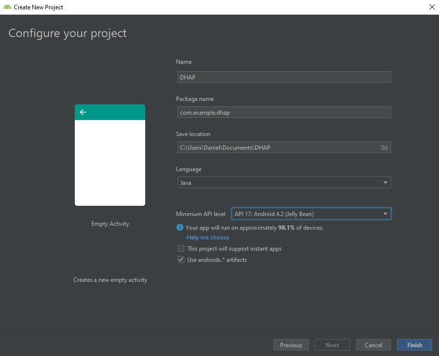
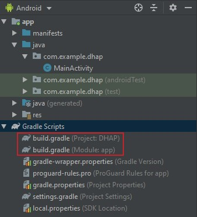

# Android Guide

This guide will take you through the process of developing a basic Android application using our library. A completed example application can be found in the [Android Repo](https://github.com/decentralised-home-automation-protocol/DHAP-Android) which has the ability to Join, Discover and Control compliant IoT devices.

## Library installation

While quick and basic installation instruction can be found [here](https://decentralised-home-automation-protocol.github.io/DHAP-Documentation/guide/#android), this section will explain the installation of the library in much more detail and is recommended for those who are new to Android development.

The Android library requires a minimum API level of `17`. This means that any API level that is 17 or higher can be used for your android application. The minimum API level can be set when creating a new project in Android Studio. Simply select any API level that is at least 17 or higher in the `Minimum API level` dropdown as shown below.



The next step is to update the `Gradle` configuration to allow for the library to be included in your project. This requires us to modify the `build.gradle` and `app/build.gradle` files. These can be located under the `Gradle Scripts` tab in Android studio when the file structure is set to `Android`. These files are shown in the image below.



**Step 1**: Add the JitPack repository to your projects `build.gradle`. The line we want to add is the highlighted line 4 shown below.

``` gradle {4}
allprojects {
  repositories {
    ...
    maven { url 'https://jitpack.io/' }
  }
}
```
We are going to add this to the first file shown in the above image (the one labeled `build.gradle (Project: DHAP)`). Once you add this line, Android studio will prompt you to sync the project, do this by clicking `Sync Now`.

<details>
  <summary>As a guide, the gradle file of the new project I created while writing this tutorial now looks like this.</summary>
  
``` {15}
buildscript {
    repositories {
        google()
        jcenter()        
    }
    dependencies {
        classpath 'com.android.tools.build:gradle:3.5.0'
    }
}

allprojects {
    repositories {
        google()
        jcenter()
        maven { url 'https://jitpack.io/' }
    }
}

task clean(type: Delete) {
    delete rootProject.buildDir
}
```
</details>

The next step is to modify the `app/build.gradle` file (this one was labeled `build.gradle (Module: app)`). 

First we want to add the libraries dependency by adding line 3 below.

``` gradle {3}
dependencies {
  ...
  implementation 'com.github.decentralised-home-automation-protocol:dhap:0.1.0'
}
```

Next we want to add Java 1.8 compatibility by adding in lines 3-6.

``` gradle {3-6}
android {
  ...
  compileOptions {
      targetCompatibility JavaVersion.VERSION_1_8
      sourceCompatibility JavaVersion.VERSION_1_8
  }
}
```

<details>
  <summary>Again, my build.gradle file now looks like this.</summary>
  
``` {19-22,32}
apply plugin: 'com.android.application'

android {
    compileSdkVersion 28
    defaultConfig {
        applicationId "com.example.dhap"
        minSdkVersion 17
        targetSdkVersion 28
        versionCode 1
        versionName "1.0"
        testInstrumentationRunner "androidx.test.runner.AndroidJUnitRunner"
    }
    buildTypes {
        release {
            minifyEnabled false
            proguardFiles getDefaultProguardFile('proguard-android-optimize.txt'), 'proguard-rules.pro'
        }
    }
    compileOptions {
        targetCompatibility JavaVersion.VERSION_1_8
        sourceCompatibility JavaVersion.VERSION_1_8
    }
}

dependencies {
    implementation fileTree(dir: 'libs', include: ['*.jar'])
    implementation 'androidx.appcompat:appcompat:1.1.0'
    implementation 'androidx.constraintlayout:constraintlayout:1.1.3'
    testImplementation 'junit:junit:4.12'
    androidTestImplementation 'androidx.test:runner:1.2.0'
    androidTestImplementation 'androidx.test.espresso:espresso-core:3.2.0'
    implementation 'com.github.decentralised-home-automation-protocol:dhap:0.1.0'
}
```
</details>

::: tip
You'll be prompted again to Sync your project. Don't forget to do this!
:::

Now your all set and ready to develop your app with the DHAP library.

## Library Usage

To use the DHAP library, you must first create an instance DHAP object to be used to interact with the library. This can be easily done in the `onCreate` method in `MainActivity` of our simple application as shown below.

```Java {2,9}
public class MainActivity extends AppCompatActivity {
    private DHAP dhap;

    @Override
    protected void onCreate(Bundle savedInstanceState) {
        super.onCreate(savedInstanceState);
        setContentView(R.layout.activity_main);

        dhap = new DHAP(this);
    }
}
```
We will want to pass the DHAP object `this` into its constructor as it needs a reference to the `context` of the current Activity.

### Discovery

The first thing we would generally want our app to do is discover any devices on a network. This can be achieved by calling the `discoverDevices` function on the `DHAP` object. 

```Java
dhap.discoverDevices(new DiscoverDevicesCallbacks() {
    @Override
    public void foundDevices(List<Device> devices) {
        Log.e(TAG, "Devices found.");
        displayDiscoveredDevices(new ArrayList<>(devices));
    }

    @Override
    public void noDevicesFound() {
        Log.e(TAG, "No devices found.");
        displayNoDevicesFound();
    }

    @Override
    public void discoveryFailure() {
        Log.e(TAG, "Discovery failed.");
    }
});
```

This method, like many in the DHAP library has a number of different `callbacks`. These callback functions will be called when a specific condition has been met during the execution of the protocol. These functions are usually called at the completion of the protocol but some will be called during execution. Many of the functions in the DHAP library utilise callbacks as they allow for specific actions to be taken at specific points in the execution of a protocol and they make for easier development.

To use callbacks, we must create a class which implements the relevant callback interface. For the `discoverDevices` function, we must create a class which implements the `DiscoverDevicesCallbacks` interface. In the above example we are creating an anonymous class and defining the relevant methods to make the code much more concise. If you wish, you can create a class, implement the relevant interface and then instantiate an instance of that class and pass it as a parameter into the `discoverDevices` function instead.

As the names imply, the relevant function will be called at the completion of discovery. If no devices are found, the `foundDevices` function is called. However if devices are found, the `foundDevices` method is called. This method will be called with a list of `Device` objects which represent each device that was found. This class allows us to get several pieces of information about a device such as its name, location or IP and mac addresses. This object will also be used later to retrieve the devices interface.

### Joining

The Joining API allows for an IoT device to be added to a home network. The Joining protocols that the procedure should first verify the home network credentials, connect to the IoT device and send the credentials and then finally the device will use the credentials to connect to the network. The Joining API allows for this entire process to be completed in one function call. In addition, the API also allows for these steps to be completed one at a time with separate function calls if the developer wishes.

To complete the protocol in one step, we will call the `joinDevice` function as seen below.

```Java
String homeSSID = "homeSSID";
String homePassword = "homePassword";
String deviceSSID = "deviceSSID";
String devicePassword = "devicePassword";

dhap.joinDevice(homeSSID, homePassword, deviceSSID, devicePassword, new JoinDeviceCallbacks() {
    @Override
    public void networkNotFound(String SSID) {
      Log.d("Joining", "Network with SSID: " + SSID + " not found!");
    }

    @Override
    public void credentialsAcknowledged() {
      Log.d("Joining", "Credentials Acknowledged");
    }

    @Override
    public void sendCredentialsTimeout() {
      Log.d("Joining", "Joining Failed. Sending credentials timed out");
    }

    @Override
    public void success() {
      Log.d("Joining", "Device Successfully Joined");
    }

    @Override
    public void failure(String message) {
      Log.d("Joining", "Joining Failed. " + message);
    }
});
```

This function takes 4 strings and an instance of the `JoinDeviceCallbacks` interface as its parameters. The strings pass represent the SSID and password of the home network and the IoT device. More then one of the callbacks for this function will be called during the joining procedure. A successful joining procedure will result in both the `credentialsAcknowledged` and `success` functions being called. The other methods will be called in the event of failure.

This function will cause the users device to first disconnect from any WiFi network they are currently connected to. The device will then attempt to connect to the home network. If the SSID could not be found `networkNotFound` will be called and the function will return. IF the password is incorrect or it could not connect for some other reason, `failure` will be called with a relevant error message. Once connected, the device will again disconnect from the network and then attempt to connect to the IoT devices access point. in the event of failure, the same functions will be called as with the home network connection. Once the device has connected to the IoT device, the credentials will be sent and the `credentialsAcknowledged` will be called if an acknowledgement is received. The device will attempt to send the credentials for 20 seconds and will return can call `sendCredentialsTimeout` if an acknowledgement is not received before then. Once the IoT device has joined the network and sent a confirmation message to the device, the `success` function will then be called.

The other functions offered, `connectToAccessPoint` and `sendCredentials` allow for the components of the joining procedure to be completed independently. These functions are explained in the [Android API](https://decentralised-home-automation-protocol.github.io/DHAP-Documentation/api/android.html#joining)

### Display and Control

The user interface of a device can be retrieved by calling the `fetchDeviceInterface` function.

```Java
dhap.fetchDeviceInterface(device, new GetDeviceInterfaceCallbacks() {
    @Override
    public void deviceActivityIntent(Intent intent) {
        startActivity(intent);
    }

    @Override
    public void invalidDisplayXmlFailure() {
        Log.d(TAG, "invalidDisplayXmlFailure");
    }

    @Override
    public void displayTimeoutFailure() {
        Log.d(TAG, "displayTimeoutFailure");
    }
});
```

This function requires a Device object to be passed as a parameter. This object should be one of the devices retrieved from the `discoverDevices` function call.

Upon the successful retrieval of the device interface, the `deviceActivityIntent` callback will be called. This method will pass an Android `intent` which can be used to start an activity that will display the user interface of the IoT device. In addition, this activity will also automatically handle status updates for you as well as sending IoT commands to the IoT device when an action is performed. This function will also check that the xml retrieved is valid and will call the `invalidDisplayXmlFailure` if it is not. Furthermore if not interface is retrieved from the device, the `displayTimeoutFailure` function will be called.

If you do not wish to use this activity, you can retrieve the xml of a device by calling the `getDeviceLayout` function on the device object after the `deviceActivityIntent` callback has been called. This `DeviceLayout` class hold all the relevant data for a devices interface as well as functions to update the interface when a new status update is received. To generate a ViewGroup to apply to your own custom activity, call the `getDeviceViewGroup` function on the `Device` object. This function requires the `supportFragmentManager` and a `context` as its parameters. Below is an example `onCreate` function of an activity where the `Device` object has been passed as an extra.

```Java
@Override
protected void onCreate(Bundle savedInstanceState) {
  super.onCreate(savedInstanceState);

  device = getIntent().getParcelableExtra("device");

  ScrollView scrollView = new ScrollView(this);
  ViewGroup viewGroup = device.getDeviceViewGroup(getSupportFragmentManager(), this);
  scrollView.addView(viewGroup);

  setContentView(scrollView);
}
```

Status updates can be manually requested by instantiating an instance of the `StatusUpdates` class. This class requires a reference to the `Device` object it will be receiving status updates and requesting leases from. to request a new lease call the `requestStatusLease` function. This function will need to be passed three values, the leaseLength and update period in ms as well as a boolean to determine if a lease response is required.

```Java
statusUpdates.requestStatusLease(10000, 1000, false);
```

To leave a lease, simply call the `leaveLease` function. The `StatusUpdates` class will continue to renew expired leases continuously until the `leaveLease` function is called.

It is important to note that a custom activity will need to implement the `OnElementCommandListener` interface to receive messages when the user interacts with the elements on screen. This data should then be passed to the `sendIoTCommand` function of the `DHAP` class to send this action on to the IoT device.

<details>
  <summary>An example custom activity can be seen by expanding this section.</summary>
  
```Java
public class DeviceActivity extends AppCompatActivity implements OnElementCommandListener {
    private Device device;
    private StatusUpdates statusUpdates;
    private DHAP dhap;

    @Override
    protected void onCreate(@Nullable Bundle savedInstanceState) {
        super.onCreate(savedInstanceState);
        device = getIntent().getParcelableExtra("device");

        ScrollView scrollView = new ScrollView(this);
        ViewGroup viewGroup = device.getDeviceViewGroup(getSupportFragmentManager(), this);
        scrollView.addView(viewGroup);

        statusUpdates = new StatusUpdates(device);
        dhap = new DHAP(this);

        setContentView(scrollView);
    }

    @Override
    public void onElementCommand(String tag, String data) {
        dhap.sendIoTCommand(tag, data, device);
    }

    @Override
    protected void onResume() {
        super.onResume();
        statusUpdates.requestStatusLease(10000, 1000, false);
    }

    @Override
    protected void onStop() {
        super.onStop();
        statusUpdates.leaveLease();
    }
}
```
</details>