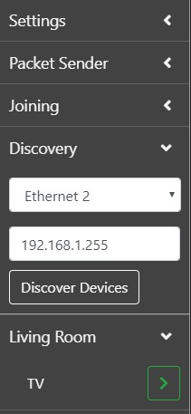
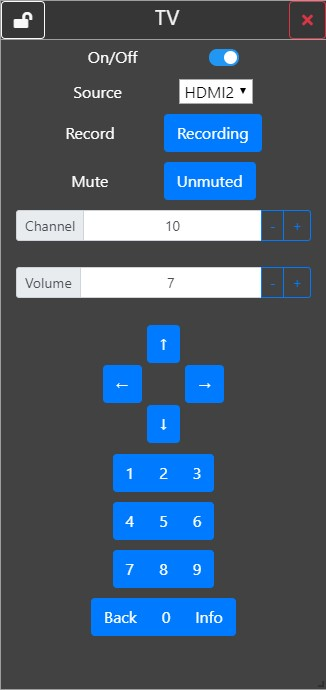

# Desktop Application

The Desktop application is a multi platform app which allows you to view multiple devices simultaneously. This application will work on Windows, Mac and Linux and only requires the device to be connected to your home network to function.

## Installation

Clone the [Desktop Repo](https://github.com/decentralised-home-automation-protocol/DHAP-Desktop)

Ensure you have the latest version of [yarn](https://yarnpkg.com/lang/en/) or [npm](https://www.npmjs.com/get-npm) installed.

In the root directory of the repo you just cloned, run the following commands in a terminal.

You must first install the dependencies with
``` bash
# yarn
yarn 

# npm
npm install
```

To run the project in a development environment use
```bash
# yarn
yarn run dev

# npm
npm run dev
```

Or alternatively you can build the project with.
```bash
# yarn
yarn run build

# npm
npm run build
```
The project will be built into a folder called `build` in the same directory.

A note for Windows users: This project was created using electron-vue which may require additional build tools to be installed to build the project. If you run into issues building the project, please refer to the [electron-vue](https://simulatedgreg.gitbooks.io/electron-vue/content/en/getting_started.html#a-note-for-windows-users) documentation.


## Usage

This project allows for multiple IoT devices that support the DHAP protocol to be used simultaneously.
Devices can be discovered and controlled. In addition, if this project is deployed to a WiFi capable machine, IoT devices can also be joined onto a home network.

### Discovery

Discovery is achieved by clicking on the `discovery` tab on the sidebar to the left. This will expand the discovery tab where the current network interface and its broadcast address will be shown. The application will attempt to select the correct network interface and its broadcast address. However, a different interface can be chosen by selecting it from the dropdown box. In addition, the broadcast address can be changed by typing a different address in the text box.

To begin discovery, click the `Discover Devices`. A progress indicator will appear while the discovery protocol is in motion. Once this indicator disappears, discovery has been completed. Any devices that have been discovered will appear in the sidebar. Devices will initially appear as an IP address until the packet header has been received. At this point, the device will be moved to a tab which corresponds to its location.



### Joining

Joining is only available for devices with WiFi capabilities. Joining can be started by expanding the `Joining` tab in the sidebar. If this tab displays the message `No WiFi detected` it means that no access points where found while scanning. This is most likely due to the WiFi on the device being non-existent or disabled. 

The joining tab contains a dropdown box for both your home network and the IoT device. Select the relevant networks in each dropdown, enter their associated passwords and click `Join Device`. A loading indicator will appear while joining is in progress. Your device will automatically change networks to the IoT device and send the credentials. The loading indicator will disappear once joining is complete. At this point you should click `Discover Devices` in the discovery tab to find your new device.

### Device Interfaces

Device interfaces can be retrieved by first expanding the relevant location tab in the sidebar. This will display all of the known devices with the same location. To get the user interface of a device, click on the green arrow to the right of the device name. This will retrieve the device xml and display it in its own window. In addition, this process will also request a status update lease from the device. When new status updates are received, the relevant element in the UI will be automatically updated. While the UI window is active, the application will continue to request status leases when they expire. To remove an interface, click the red cross in the top right of the interface window.


