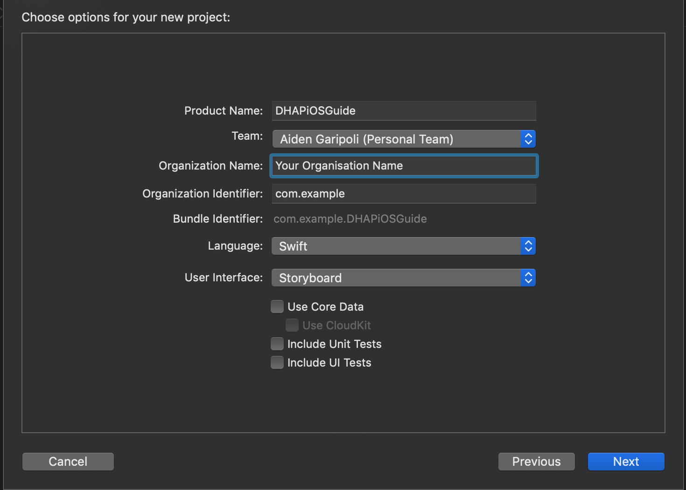

# iOS Library

This guide will walk you through a simple application that will allow you to get up and running with the DHAP iOS library. To begin, create a new project in XCode.

File > New Project.

Select `Single View App`.

Ensure that you have selected Swift as the language and Storyboard for the user interface as shown below.

Give the project a name and enter your organisation name and identifier.



Now the project is setup, follow the link below to install the Library.

## Library Installation

See [iOS Installation](/guide/#ios) for library installation instructions. Ensure that you are opening the workspace and not the project.

## Usage

Now that the library is installed, you need to create an instance of the `DHAP` class which will give you access to all of the libraries functionality. For this guide, we'll use the ViewController XCode has created for us.

Navigate to `ViewController.swift` and add the following highlighted lines of code:

``` swift {2,6,11}
import UIKit
import DHAP

class ViewController: UIViewController {

    var dhap: DHAP?
    
    override func viewDidLoad() {
        super.viewDidLoad()
        // Do any additional setup after loading the view.
        dhap = DHAP()
    }

}

```

Now you can begin using the library to discovery devices which we will do next.

### Discovery

Before you can begin controlling devices, you must discover them. To do this, you will use the DHAP instance and call the `discoverDevices` method.

Once again, navigate to `ViewController.swift` and add the following highlighted lines of code:

``` swift {13,16-27}
import UIKit
import DHAP

class ViewController: UIViewController {

    var dhap: DHAP?
    
    override func viewDidLoad() {
        super.viewDidLoad()
        // Do any additional setup after loading the view.
        dhap = DHAP()
        
        findDevices()
    }

    func findDevices() {
        dhap?.discoverDevices(completion: { (result) in
            switch result {
            case .foundDevices(let devices):
                print("Found \(devices.count) devices.")
            case .noDevicesFound:
                print("No devices found.")
            case .failure(let error):
                print(error.localizedDescription)
            }
        })
    }

}

```

The `discoverDevices` method will perform the DHAP discovery protocol and return to you the results of the operation in the callback. The result will be one of `.foundDevices`, `.noDevicesFound` or `.failure`.

Where `.foundDevices` means that the operation was successful and the library found one or more compliant devices on the network. 

`.noDevicesFound` means that the operation was successful but the library did not find any compliant devices on the network.

`.failure` means that something went wrong during the discovery process and you can handle this in your application.

### Display and Control


